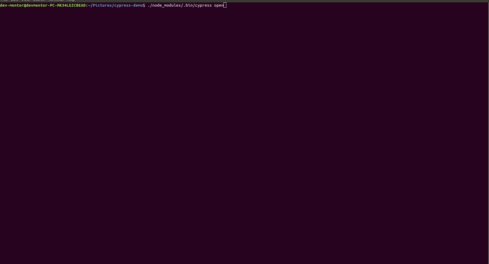
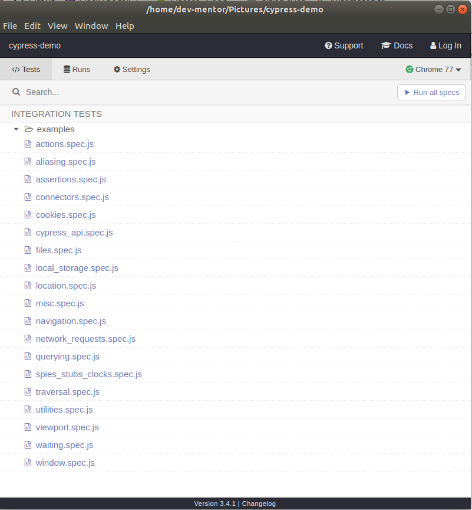
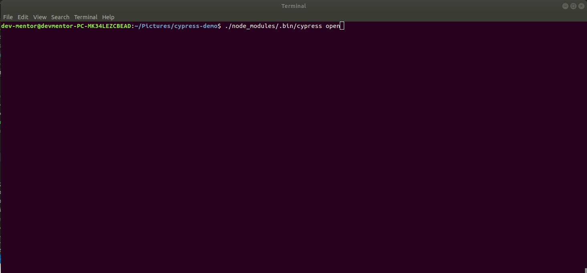
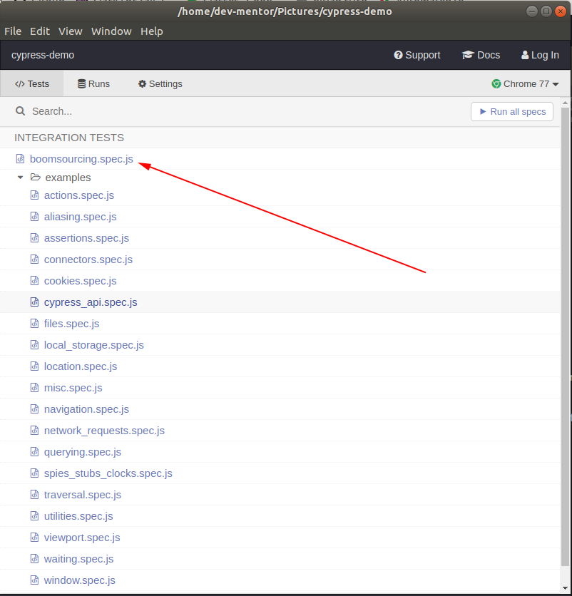

## Cypress 

### What is an automation testing

TODO: Description 

### Automation testing with cypress 

1. What is Cypress = TODO 

2. Why automation testing is important is software development = TODO

3. Cypress vs Selenium = TODO


### Cypress Installation 

1. Initilize default `package.json`.

```
dev-mentor@devmentor-PC-MK34LEZCBEAD:~/Pictures/cypress-demo$ npm init -y
Wrote to /home/dev-mentor/Pictures/cypress-demo/package.json:

{
  "name": "cypress-demo",
  "version": "1.0.0",
  "description": "",
  "main": "index.js",
  "scripts": {
    "test": "echo \"Error: no test specified\" && exit 1"
  },
  "keywords": [],
  "author": "",
  "license": "ISC"
}
```

2. Install `cypress`

```
dev-mentor@devmentor-PC-MK34LEZCBEAD:~/Pictures/cypress-demo$ npm install cypress

> cypress@3.4.1 postinstall /home/dev-mentor/Pictures/cypress-demo/node_modules/cypress
> node index.js --exec install

Installing Cypress (version: 3.4.1)

 ✔  Downloaded Cypress
 ✔  Unzipped Cypress
 ✔  Finished Installation /home/dev-mentor/.cache/Cypress/3.4.1

You can now open Cypress by running: node_modules/.bin/cypress open

https://on.cypress.io/installing-cypress

npm notice created a lockfile as package-lock.json. You should commit this file.
npm WARN cypress-demo@1.0.0 No description
npm WARN cypress-demo@1.0.0 No repository field.

+ cypress@3.4.1
added 188 packages from 125 contributors and audited 314 packages in 89.972s
found 0 vulnerabilities

```

You should now have the following:

```
dev-mentor@devmentor-PC-MK34LEZCBEAD:~/Pictures/cypress-demo$ ls
cypress  cypress.json  node_modules  package.json  package-lock.json
```

Installing Cypress will take around 2 to 3 minutes, based on your network speed.

3.  Once you have done with the installation part, you will open Cypress for the first time by executing this command at the location where you have your `package.json`

```
dev-mentor@devmentor-PC-MK34LEZCBEAD:~/Pictures/cypress-demo$ ./node_modules/.bin/cypress open
```




During first time with cypress there are some possible errors you may encounter like missing library or dependency. example is `libgconf-2.so.4: cannot open shared object file: No such file or directory` that you can resolved by `sudo apt -y install libgconf2-4`

Cypress GUI 



Cypress comes with its own folder structure. This folder is automatically generated when you open Cypress for the first time at that location. It comes with ready-made recipes that show you how to test common scenarios in Cypress.

We keep our test data in a `.json` format inside `fixtures` folder and write tests inside the `integration` folder following the same naming convention. Any custom command will come up under the support folder.

Summary :

1. project/cypress/Fixtures = Represents the static test data that can store in `.json` format.
2. project/cypress/Integration = The actual test suites contains `spec.js` files.


### Running our first test suite

1. We need to disable the CORS issue by setting `chromeWebSecurity` into `false` under `cypress-demo/cypress/cypress.json`.

```
{
    "chromeWebSecurity": false
}
```

2. Create `boomsourcing.spec.js` file under `cypress-demo/cypress/integration/` and paste the ff code.

```
//This is where your test suite starts
describe('My first test suite', function () {

    //This function will execute before each test (i.e it())
    beforeEach(function () {

        //Visit google
        cy.visit('https://www.google.com/')

    })

    //The actual suite
    it('Visits the boomsourcing site', function () {

           // Get an input, with name q type 'boomsourcing' and verify that the value is the same as 'boomsourcing'.
           cy.get('input[name=q]')
           .type('boomsourcing')
           .should('have.value', 'boomsourcing')
           
           //Get an input, with name btnK and the text is 'Google Search' then click.
           cy.get('input[name=btnK]').contains('Google Search').click()

           //Click first a tag with link 'https://boomsourcing.com/' and click
           cy.get('a[href="https://boomsourcing.com/"]').first().click()

           //Get span, that has text 'Google Search' then click.
           cy.get('span').contains('About Us').click()

    })
})
```

2. Open cypress GUI 

```
dev-mentor@devmentor-PC-MK34LEZCBEAD:~/Pictures/cypress-demo$ ./node_modules/.bin/cypress open
```



3. Find and click `boomsourcing.spec.js` it will open a new browser that will run our first test suite.




Demonstration :


